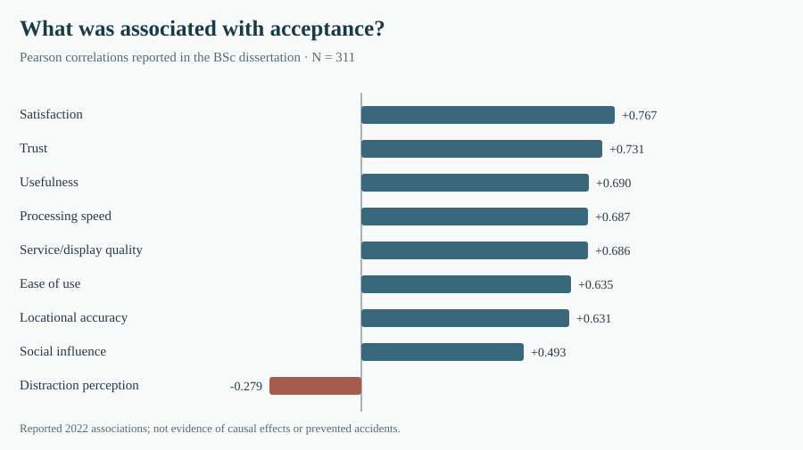
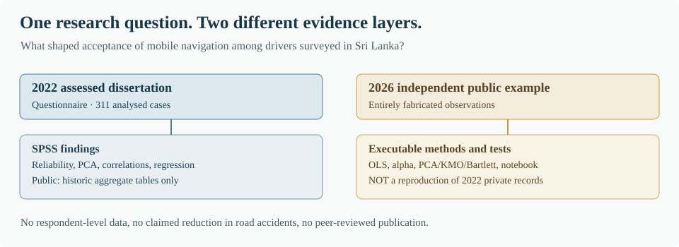

# Driver acceptance of mobile navigation systems in Sri Lanka

**My BSc research at Cardiff Metropolitan University, 2022**  
Mohamed Fawaz Hussain Fareed · Business Information Systems (First Class)

I chose this subject because navigation had become something drivers could access quite easily through their phones. There were obvious advantages: knowing the route, understanding traffic conditions, and receiving information before reaching an unfamiliar area. But I did not think the availability of a system, by itself, explained whether a driver would accept it.

In Sri Lanka, where traffic conditions and the information available to drivers can vary, I wanted to find out which parts of the experience mattered. Was it accuracy? The speed and quality of the information? Trust? Or how distracting the system felt while driving?

That became the central question of my dissertation, *An Explorative Study on Driver Acceptance of Mobile Navigation Systems to Mitigate Road Accidents in Sri Lanka*, submitted on **12 June 2022**.

[Read the redacted 2022 dissertation](submitted_bsc_record/THESIS_PUBLIC_READING_COPY.md) · [How I approached the research](docs/THE_RESEARCH.md) · [My original findings](docs/RESULTS_2022.md) · [Explore the notebook](notebooks/overview.ipynb) · [Run the Python examples](docs/REPRODUCE.md)

## Working through the evidence

I studied nine possible influences on driver acceptance: perceived ease of use, usefulness, locational accuracy, processing speed, service and display quality, distraction perception, satisfaction, social influence and trust.

The research was quantitative. I used questionnaire responses and **IBM SPSS** to check the measures, examine the individual relationships with driver acceptance and build a multiple regression model. The final statistical analysis contained **311 responses**.

One result stood out to me when reading the models together. **Satisfaction (r = .767)** and **trust (r = .731)** had the strongest positive correlations with acceptance. They were also the two factors that met the study's **1% significance threshold** in the model containing all nine predictors.

Perceived usefulness had a p-value of **.011** in that model. It is very close to .01, but it is still above the threshold I used. That is an important difference between the individual correlations and the regression results.

The model reported **R² = .679**. It accounts for variation in the acceptance scores of the analysed respondents. It was never a measurement of how many road accidents were prevented, and the study did not observe actual driving incidents.

[Read the figures as they appeared in the original dissertation](docs/RESULTS_2022.md) · [See the published aggregate tables](data/published_2022_aggregates/)

## Looking at my earlier work again

Revisiting the analysis has been useful because I would now challenge some of the decisions more carefully.

For instance, a high Cronbach's alpha can tell me the items within a scale are consistent, but it cannot establish by itself that they capture exactly the construct I intended. The **KMO value of .500** for a two-item scale is another example. In that particular mathematical setting the value is fixed by the formula; it should not be interpreted as independent validation.

I would also want to investigate whether trust and satisfaction are sufficiently distinct, whether drivers in other parts of the country would respond similarly, and whether acceptance leads to actual use. Connecting that use to road safety would require an entirely different set of observations.

I have written those questions down in [what I would investigate next](docs/WHAT_I_WOULD_TEST_NEXT.md). They are areas for further work, not findings I am claiming to have already established.

## What you can inspect

| Material | What it contains |
|---|---|
| [Research design](docs/THE_RESEARCH.md) and [measures](docs/MEASURES_AND_METHODS.md) | The questionnaire constructs and original SPSS approach |
| [Results](docs/RESULTS_2022.md) | Correlations, regression and the interpretation of the reported coefficients |
| [Public data tables](data/published_2022_aggregates/) | Aggregate reliability, exploratory structure and regression figures reported in 2022 |
| [Jupyter notebook](notebooks/overview.ipynb) | Historical aggregate charts followed by clearly identified synthetic examples |
| [Python demonstration](docs/REPRODUCE.md) | Runnable statistical calculations using fabricated data, with tests |
| [Reproducibility checklist](docs/REPRODUCIBILITY_CHECKLIST.md) | What another researcher can verify from the public files |
| [Data and disclosure](data/DATASET_CARD.md) | Data scope, privacy and reuse restrictions |

**A note on the two periods of work:** the dissertation and its SPSS findings belong to **2022**. The Python code and further methodological examination were developed **after the degree**. The Python examples use fabricated observations; they do not reproduce the original respondent-level analysis. Original survey records, SPSS files and the unredacted dissertation remain private pending appropriate release review. The assessed document also contains differing initial response totals (325 and 326), which I have [recorded without inventing a reconciliation](docs/EVIDENCE_AND_LIMITATIONS.md).

For my subsequent work in machine learning, see [my MSc solar-flare classification research](https://github.com/fazzyy10/solar-flare-ml-class-imbalance).

---

*Mohamed Fawaz Hussain Fareed · Cardiff, United Kingdom*  
[Original study citation and permissions](docs/CITATION_AND_PERMISSIONS.md)
